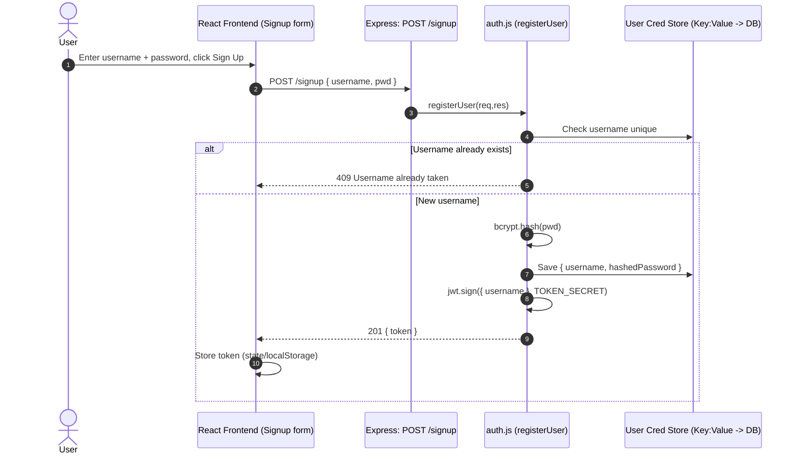
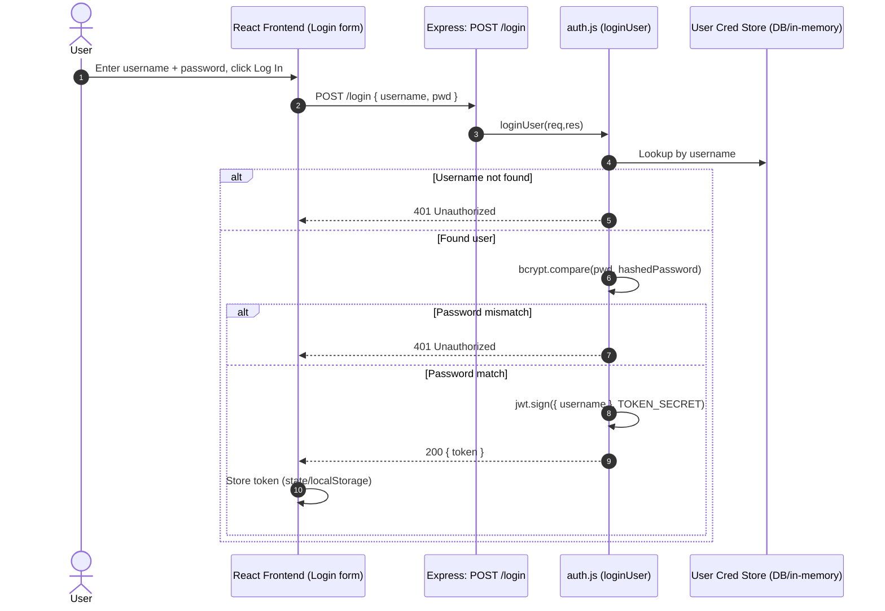
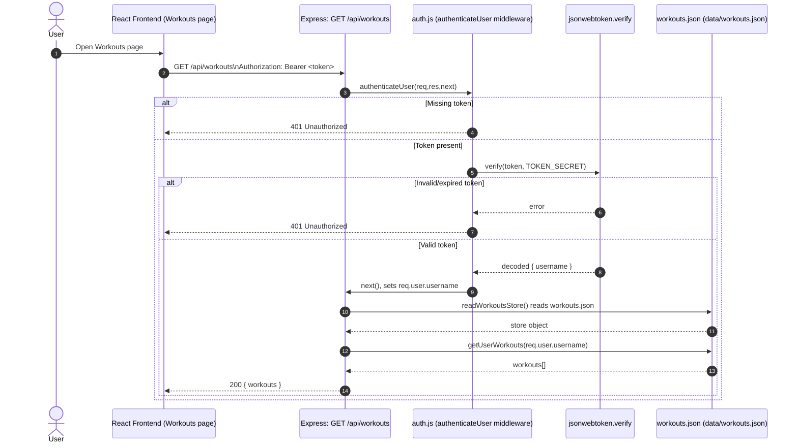

```mermaid
sequenceDiagram
  autonumber
  actor U as User
  participant FE as React Frontend (Signup form)
  participant BE as Express: POST /signup
  participant Auth as auth.js (registerUser)
  participant Creds as User Cred Store (Key:Value -> DB)

  U->>FE: Enter username + password, click Sign Up
  FE->>BE: POST /signup { username, pwd }
  BE->>Auth: registerUser(req,res)

  Auth->>Creds: Check username unique
  alt Username already exists
    Auth-->>FE: 409 Username already taken
  else New username
    Auth->>Auth: bcrypt.hash(pwd)
    Auth->>Creds: Save { username, hashedPassword }
    Auth->>Auth: jwt.sign({ username }, TOKEN_SECRET)
    Auth-->>FE: 201 { token }
    FE->>FE: Store token (state/localStorage)
  end
```

```mermaid
sequenceDiagram
  autonumber
  actor U as User
  participant FE as React Frontend (Login form)
  participant BE as Express: POST /login
  participant Auth as auth.js (loginUser)
  participant Creds as User Cred Store (DB/in-memory)

  U->>FE: Enter username + password, click Log In
  FE->>BE: POST /login { username, pwd }
  BE->>Auth: loginUser(req,res)

  Auth->>Creds: Lookup by username
  alt Username not found
    Auth-->>FE: 401 Unauthorized
  else Found user
    Auth->>Auth: bcrypt.compare(pwd, hashedPassword)
    alt Password mismatch
      Auth-->>FE: 401 Unauthorized
    else Password match
      Auth->>Auth: jwt.sign({ username }, TOKEN_SECRET)
      Auth-->>FE: 200 { token }
      FE->>FE: Store token (state/localStorage)
    end
  end
```

```mermaid
sequenceDiagram
  autonumber
  actor U as User
  participant FE as React Frontend (Workouts page)
  participant BE as Express: GET /api/workouts
  participant MW as auth.js (authenticateUser middleware)
  participant JWT as jsonwebtoken.verify
  participant Store as workouts.json (data/workouts.json)

  U->>FE: Open Workouts page
  FE->>BE: GET /api/workouts\nAuthorization: Bearer <token>

  BE->>MW: authenticateUser(req,res,next)
  alt Missing token
    MW-->>FE: 401 Unauthorized
  else Token present
    MW->>JWT: verify(token, TOKEN_SECRET)
    alt Invalid/expired token
      JWT-->>MW: error
      MW-->>FE: 401 Unauthorized
    else Valid token
      JWT-->>MW: decoded { username }
      MW->>BE: next(), sets req.user.username
      BE->>Store: readWorkoutsStore() reads workouts.json
      Store-->>BE: store object
      BE->>Store: getUserWorkouts(req.user.username)
      Store-->>BE: workouts[]
      BE-->>FE: 200 { workouts }
    end
  end
```
